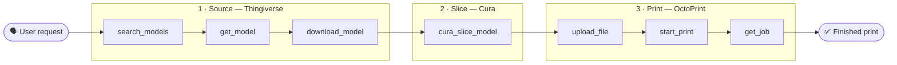

<div align="center">

# 🖨️ PrintMCP

### From *"I want to print a coffee cup"* to a finished print — driven by your AI agent.

PrintMCP is a [Model Context Protocol](https://modelcontextprotocol.io) server that automates the entire
3D-printing pipeline: **find** a model, **slice** it to G-code, and **print** it — all through tools an
AI assistant can call.


[](LICENSE)

</div>

---

## 🧭 The pipeline

PrintMCP is built in three levels. Each level is a group of tools, and together they form one continuous
workflow from a vague idea to plastic on the bed.



| Level | Scope | Backend | Status |
|:-----:|-------|---------|:------:|
| **1 · Source** | Search for and download 3D model files | [Thingiverse REST API](https://www.thingiverse.com/developers) | ✅ Implemented |
| **2 · Slice** | Slice models into printer-ready G-code | [Ultimaker Cura](https://ultimaker.com/software/ultimaker-cura/) (headless CuraEngine) | ✅ Implemented |
| **3 · Print** | Upload, start, monitor, and control prints | [OctoPrint REST API](https://docs.octoprint.org/en/master/api/) | ✅ Implemented |

---

## 📑 Table of contents

- [✨ Highlights](#-highlights)
- [🛡️ Safety model](#️-safety-model)
- [🧰 Tool reference](#-tool-reference)
- [📦 Requirements](#-requirements)
- [🚀 Quick start](#-quick-start)
- [⚙️ Configuration](#️-configuration)
- [🔌 Register with an MCP client](#-register-with-an-mcp-client)
- [💡 Example: coffee cup to print](#-example-coffee-cup-to-print)
- [🗂️ Project structure](#️-project-structure)
- [🧪 Development](#-development)
- [🗺️ Roadmap](#️-roadmap)
- [⚖️ Model licensing](#️-model-licensing)
- [📄 License](#-license)

---

## ✨ Highlights

- **One server, the whole pipeline.** Search → download → slice → print, without leaving your assistant.
- **License-aware sourcing.** Every model's license is surfaced *before* you download, so you don't misuse it.
- **Real slicing, real estimates.** Drives the same CuraEngine that Ultimaker Cura ships, and reports the
  true print time and filament usage from the engine itself.
- **Safe by default.** Tools that physically actuate the printer (heaters, motors) refuse to act unless you
  explicitly pass `confirm=true` — see [Safety model](#️-safety-model).
- **Structured *or* human output.** Every tool accepts `response_format` (`markdown` or `json`).
- **Zero-secret-in-output design.** Credentials live in `.env` and are sent only to the services they belong to.

---

## 🛡️ Safety model

> [!WARNING]
> **Level 3 drives a real machine.** A bad tool call could heat a nozzle, move an axis, or abandon a print.

To prevent accidents, **every physical-actuation tool defaults to a dry run.** Called without `confirm`, it
describes exactly what *would* happen and **sends nothing** to the printer. Pass `confirm=true` to actually act.

```text
octoprint_start_print(path="cup.gcode")              → 🟡 dry run: "this would start printing cup.gcode"
octoprint_start_print(path="cup.gcode", confirm=true) → 🟢 starts the print
```

> [!NOTE]
> Read-only tools (`octoprint_get_status`, `octoprint_list_files`, `octoprint_get_job`) never need `confirm`.
> Temperatures are also sanity-checked (e.g. the bed is capped at ~140 °C) so a typo can't command a wild value.

---

## 🧰 Tool reference

All tools accept `response_format` (`markdown` or `json`). Tools marked 🔒 physically actuate the printer and
require `confirm=true`; without it they return a harmless dry-run preview.

### Level 1 · Source — Thingiverse

| Tool | What it does |
|------|--------------|
| `thingiverse_search_models` | Keyword search for printable "things"; returns candidates with IDs. |
| `thingiverse_get_model` | Details for one thing: **license**, description, and downloadable files. |
| `thingiverse_download_model` | Download a thing's files (printable models by default) to local disk. |

### Level 2 · Slice — Cura

| Tool | What it does |
|------|--------------|
| `cura_slice_model` | Slice a local `.stl`/`.obj`/`.3mf`/`.amf`/`.ply` into G-code. Choose printer, layer height, infill, supports, adhesion, and temperatures; returns the G-code path plus estimated print time and filament. |

### Level 3 · Print — OctoPrint

| Tool | What it does | |
|------|--------------|:--:|
| `octoprint_get_status` | Connection state, printer state, and live tool/bed temperatures. | 👁️ |
| `octoprint_list_files` | List G-code files on the server, with their server-side paths. | 👁️ |
| `octoprint_get_job` | Active job: file, % complete, elapsed, and estimated time remaining. | 👁️ |
| `octoprint_connect` | Open or close the printer's serial connection. | 🔒 |
| `octoprint_upload_file` | Upload a local `.gcode` to the server (optionally select/print). | 🔒¹ |
| `octoprint_start_print` | Select a server-side file and begin printing. | 🔒 |
| `octoprint_control_job` | Pause, resume, or cancel the running job. | 🔒 |
| `octoprint_set_temperature` | Set a tool (nozzle) or bed target temperature. | 🔒 |
| `octoprint_home` | Home one or more axes. | 🔒 |
| `octoprint_move` | Jog the print head by a relative offset. | 🔒 |

<sub>👁️ read-only · 🔒 requires `confirm=true` · ¹ uploading alone is safe; only starting a print needs `confirm`.</sub>

---

## 📦 Requirements

| | Needed for | Notes |
|---|---|---|
| **Python ≥ 3.10** | everything | — |
| **[uv](https://docs.astral.sh/uv/)** | everything | Project & dependency manager. |
| **Thingiverse API token** | Level 1 | Free — [register an app](https://www.thingiverse.com/apps/create). |
| **[Ultimaker Cura](https://ultimaker.com/software/ultimaker-cura/)** | Level 2 | Its bundled CuraEngine is auto-detected on Windows. |
| **An OctoPrint server + API key** | Level 3 | Any printer running [OctoPrint](https://octoprint.org/) on your network. |

> [!TIP]
> The levels are independent. You can use Level 1 with just a Thingiverse token, add Cura later for slicing,
> and wire up OctoPrint whenever your printer is ready.

---

## 🚀 Quick start

```bash
# 1. Install (creates .venv, installs PrintMCP + dev tools, writes uv.lock)
uv sync

# 2. Configure your secrets
cp .env.example .env     # Windows: copy .env.example .env
#   …then edit .env (see Configuration below)

# 3. Run the server (stdio — it waits for an MCP client; that's expected)
uv run printmcp
```

You normally won't run the server by hand — you [register it with a client](#-register-with-an-mcp-client),
which launches it for you.

---

## ⚙️ Configuration

PrintMCP reads configuration from environment variables. A `.env` file in the project root is loaded
automatically (and is git-ignored, so your secrets stay local).

| Variable | Required | Default | Purpose |
|----------|:--------:|---------|---------|
| `THINGIVERSE_TOKEN` | Level 1 | — | Thingiverse REST API App Token. |
| `PRINTMCP_DOWNLOAD_DIR` | — | `~/PrintMCP/downloads` | Where downloaded models are saved. |
| `PRINTMCP_CURA_DIR` | — | auto-detected | Ultimaker Cura install folder (e.g. `C:\Program Files\UltiMaker Cura 5.11.0`). Set only if auto-detection fails. |
| `PRINTMCP_CURAENGINE` | — | `<cura>/CuraEngine.exe` | Full path to the CuraEngine executable, if it lives outside the Cura folder. |
| `OCTOPRINT_URL` | Level 3 | — | Base URL of your OctoPrint server, e.g. `http://octopi.local` or `http://192.168.1.50:80`. |
| `OCTOPRINT_API_KEY` | Level 3 | — | OctoPrint API key. Sent only in the `X-Api-Key` header to `OCTOPRINT_URL`. |

<details>
<summary><b>Where do I get each credential?</b></summary>

- **Thingiverse token** — Create an app at <https://www.thingiverse.com/apps/create> and copy its **App Token**.
- **OctoPrint API key** — In OctoPrint: **Settings → API** (global key), or generate a per-user **Application Key**
  under your user account. Either works.

</details>

---

## 🔌 Register with an MCP client

<details open>
<summary><b>Claude Desktop</b> (<code>claude_desktop_config.json</code>)</summary>

```json
{
  "mcpServers": {
    "printmcp": {
      "command": "uv",
      "args": [
        "run",
        "--directory",
        "C:\\Users\\Sbuss\\Documents\\Software Development\\Projects\\PrintMCP",
        "printmcp"
      ]
    }
  }
}
```

</details>

<details>
<summary><b>Claude Code CLI</b></summary>

```bash
claude mcp add printmcp -- uv run --directory "C:\Users\Sbuss\Documents\Software Development\Projects\PrintMCP" printmcp
```

</details>

> [!TIP]
> Point `--directory` at wherever you cloned PrintMCP. The client launches the server and talks to it over stdio.

---

## 💡 Example: coffee cup to print

A full pipeline run, the way an assistant would drive it:

```text
1.  thingiverse_search_models(query="coffee cup")
        → browse results, pick an id

2.  thingiverse_get_model(thing_id=4928322)
        → check the LICENSE and the file list

3.  thingiverse_download_model(thing_id=4928322)
        → .stl files land in your download directory

4.  cura_slice_model(model_path="…/cup.stl")
        → writes cup.gcode (Ender-3 Pro, 0.2 mm, 20% infill)
          + reports "≈ 6h 31m, 25.5 m filament"

5.  octoprint_get_status()
        → confirm the printer is connected and ready
          (octoprint_connect(confirm=true) if not)

6.  octoprint_upload_file(gcode_path="…/cup.gcode")
        → note the returned server path

7.  octoprint_start_print(path="cup.gcode", confirm=true)
        → 🟢 printing begins

8.  octoprint_get_job()
        → watch progress: "42% · 2h 14m remaining"
```

> [!NOTE]
> Steps 5–7 talk to a live printer. Tools that move the machine need `confirm=true`; everything up to slicing
> is purely local.

---

## 🗂️ Project structure

```text
PrintMCP/
├── src/printmcp/
│   ├── app.py          # shared FastMCP instance
│   ├── server.py       # entry point — registers tools, runs over stdio
│   ├── config.py       # env-driven config (tokens, Cura paths, OctoPrint URL/key)
│   ├── thingiverse.py  # Level 1 — search & download
│   ├── cura.py         # Level 2 — slice via CuraEngine
│   └── octoprint.py    # Level 3 — print management
├── tests/test_server.py
├── .env.example
├── pyproject.toml
└── README.md
```

---

## 🧪 Development

```bash
uv run pytest
```

The suite is **fully offline** — it requires **no token, network, or Cura install** and runs in under two
seconds. It covers:

- **Input validation & helpers** — tool registration, filename sanitization, slice-input ranges, stats parsing.
- **The Level 3 safety gate** — every actuating tool refuses to act (and sends nothing) without `confirm=true`.
- **OctoPrint HTTP plumbing** — using a mock transport, it asserts the exact method, path, JSON body, and
  `X-Api-Key` header of every request, that responses parse correctly, and that error statuses (401/409/
  connection-refused) map to friendly messages — all without a printer.

---

## 🗺️ Roadmap

- **More print backends** — a Moonraker/Klipper backend exposing `moonraker_*` tools alongside the OctoPrint
  ones, so non-OctoPrint printers work too.
- **Slicing depth** — more printer profiles and quality presets, and surfacing CuraEngine warnings (e.g. a
  model larger than the build volume).
- **More model sources** — Printables, MyMiniFactory, and others behind a shared search interface.

---

## ⚖️ Model licensing

Models on Thingiverse carry their own licenses (often Creative Commons; some are non-commercial).
`thingiverse_get_model` and `thingiverse_download_model` surface each model's license — **respect it** before
reusing, remixing, or selling a print.

---

## 📄 License

Licensed under the **[Apache License 2.0](LICENSE)** — © 2026 SourceBox LLC.

You may freely use, modify, and distribute this software, including for commercial purposes, provided you retain
the copyright and license notices and state any significant changes. The license also includes an express patent
grant. It comes with **no warranty**. See the [LICENSE](LICENSE) file for the full text.

> [!NOTE]
> This license covers **PrintMCP's own code only**. Third-party tools it drives (Ultimaker Cura, OctoPrint) and
> any 3D models you download carry their **own** licenses — see [Model licensing](#️-model-licensing) above.
