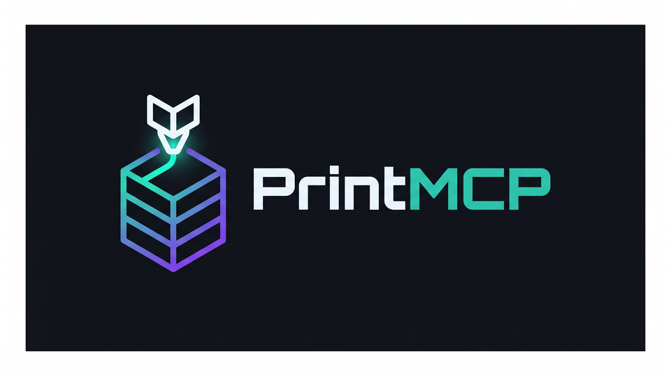
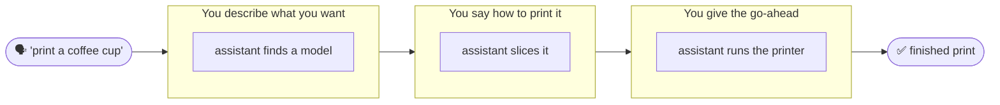

  

# 📚 PrintMCP Documentation

Welcome! This is the full documentation for **PrintMCP** — which lets you 3D print just by
**talking to your AI assistant**, taking a job from *"I want to print a coffee cup"* all the way
to plastic on the bed.

> **New in v0.1.1:** Downloads now default to your OS Downloads folder
> (`~/Downloads` on macOS/Linux, `%USERPROFILE%\Downloads` on Windows) instead
> of `~/PrintMCP/downloads`. Set `PRINTMCP_DOWNLOAD_DIR` to override.

You never operate PrintMCP directly. You chat with your assistant (Claude, or whatever client
you've connected) and it does the finding, slicing, and printing for you. The **tutorials** below
teach you how — in plain conversation, not commands. The reference pages go deeper for the
curious.

---

## 🚦 Start here

New to PrintMCP? Follow this path in order:

1. **[Getting Started](getting-started.md)** — a one-time setup: install PrintMCP and connect it
   to your assistant. ~10 minutes.
2. **[Tutorial 1 · Find Something to Print](tutorials/01-find-and-download.md)** — ask your
   assistant to find and download a model.
3. **[Tutorial 2 · Get It Print-Ready](tutorials/02-slice-for-your-printer.md)** — describe how
   you want it printed, in plain words.
4. **[Tutorial 3 · Send It to Your Printer](tutorials/03-print-with-octoprint.md)** — start and
   watch a real print, safely.
5. **[Tutorial 4 · From Idea to Object](tutorials/04-end-to-end.md)** — the whole thing in one
   conversation.

---

## 🗂️ All documentation

### Guides

| Page | What it covers |
|------|----------------|
| [Getting Started](getting-started.md) | Install with `uv`, create `.env`, verify, register with a client. |
| [Configuration](configuration.md) | Every environment variable, how to get each credential, and **where files are stored**. |
| [Safety Model](safety.md) | Why physical-actuation tools need `confirm=true`, and how the dry-run gate protects your machine. |
| [Troubleshooting](troubleshooting.md) | Common errors at each level and how to fix them. |
| [Architecture](architecture.md) | How the one-server / three-level design fits together (for contributors). |
| [Releasing](RELEASING.md) | How PrintMCP is published to PyPI (for maintainers). |

### Tool reference (under the hood)

You don't call these yourself — your assistant does. These pages are for the curious, or for
developers building on PrintMCP. **Start with the [developer overview](tools/README.md)** for the
invocation model, schemas, annotations, and error contract that all tools share.

| Page | What your assistant uses it for |
|------|--------------------------------|
| [Developer overview](tools/README.md) | The shared contract: `params` envelope, annotations, response formats, error handling, programmatic calls |
| [Level 1 · Thingiverse](tools/thingiverse.md) | Finding and downloading models |
| [Level 2 · Cura](tools/cura.md) | Slicing models into print files |
| [Level 3 · OctoPrint](tools/octoprint.md) | Uploading, printing, and controlling the printer |

### Tutorials — learn by chatting

These teach you what to **say** to your assistant, not commands to type.

| # | Tutorial | What you'll do |
|---|----------|----------------|
| 1 | [Find Something to Print](tutorials/01-find-and-download.md) | Ask for a model and get real options, with licenses checked. |
| 2 | [Get It Print-Ready](tutorials/02-slice-for-your-printer.md) | Describe the print you want — fast, strong, smooth — in plain words. |
| 3 | [Send It to Your Printer](tutorials/03-print-with-octoprint.md) | Start, watch, and pause a real print — with a safety check on anything physical. |
| 4 | [From Idea to Object](tutorials/04-end-to-end.md) | Go from request to finished print in one conversation. |

---

## 🧭 What happens when you ask

You only ever do the talking; your assistant handles the three stages — finding, slicing, and
printing. (Each works on its own, too: you can find and download models even before your printer
is set up. See [Architecture](architecture.md) for how it's built.)

---

## 💬 How to read the tutorials

- Lines marked 💬 **You** are what *you* type to your assistant.
- Lines marked 🤖 **Assistant** are roughly what it says back. (Exact wording varies — it's a
  conversation, not a script.)
- You never type commands or file paths. If you see something technical, it's optional background
  for the curious.

---

> [!TIP]
> Reading on GitHub? The Mermaid diagrams and `> [!NOTE]` callouts render automatically. In a
> plain text editor they'll appear as code/quote blocks — that's expected.
