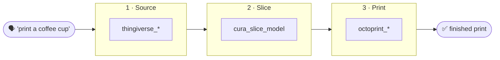

# 📚 PrintMCP Documentation

Welcome! This is the full documentation for **PrintMCP** — the MCP server that takes a
3D-printing job from *"I want to print a coffee cup"* all the way to plastic on the bed.

If you just want the elevator pitch and a feature list, the [project README](../README.md)
has that. The pages here go deeper: how to install it, how every tool works, and
hands-on tutorials that walk the whole pipeline end to end.

---

## 🚦 Start here

New to PrintMCP? Follow this path in order:

1. **[Getting Started](getting-started.md)** — install, configure, and connect PrintMCP to an
   MCP client. ~10 minutes.
2. **[Tutorial 1 · Find & Download a Model](tutorials/01-find-and-download.md)** — your first
   real task: search Thingiverse and pull down an `.stl`.
3. **[Tutorial 2 · Slice for Your Printer](tutorials/02-slice-for-your-printer.md)** — turn that
   model into printer-ready G-code.
4. **[Tutorial 3 · Print with OctoPrint](tutorials/03-print-with-octoprint.md)** — upload, start,
   and monitor a real print (safely).
5. **[Tutorial 4 · The Full Pipeline](tutorials/04-end-to-end.md)** — chain it all into one
   idea-to-object run.

---

## 🗂️ All documentation

### Guides

| Page | What it covers |
|------|----------------|
| [Getting Started](getting-started.md) | Install with `uv`, create `.env`, verify, register with a client. |
| [Configuration](configuration.md) | Every environment variable, how to get each credential, and **where files are stored**. |
| [Safety Model](safety.md) | Why physical-actuation tools need `confirm=true`, and how the dry-run gate protects your machine. |
| [Troubleshooting](troubleshooting.md) | Common errors at each level and how to fix them. |
| [Architecture](architecture.md) | How the one-server / three-level design fits together (for contributors). |

### Tool reference

| Page | Tools |
|------|-------|
| [Level 1 · Thingiverse](tools/thingiverse.md) | `thingiverse_search_models`, `thingiverse_get_model`, `thingiverse_download_model` |
| [Level 2 · Cura](tools/cura.md) | `cura_slice_model` |
| [Level 3 · OctoPrint](tools/octoprint.md) | `octoprint_get_status`, `octoprint_list_files`, `octoprint_get_job`, `octoprint_connect`, `octoprint_upload_file`, `octoprint_start_print`, `octoprint_control_job`, `octoprint_set_temperature`, `octoprint_home`, `octoprint_move` |

### Tutorials

| # | Tutorial | You'll learn to… |
|---|----------|------------------|
| 1 | [Find & Download a Model](tutorials/01-find-and-download.md) | Search Thingiverse, check a license, download files. |
| 2 | [Slice for Your Printer](tutorials/02-slice-for-your-printer.md) | Produce G-code with the right layer height, infill, and supports. |
| 3 | [Print with OctoPrint](tutorials/03-print-with-octoprint.md) | Connect, upload, start, and monitor a print. |
| 4 | [The Full Pipeline](tutorials/04-end-to-end.md) | Run idea → model → slice → print in one go. |

---

## 🧭 The pipeline at a glance

Each level is independent — you can use Level 1 with just a Thingiverse token, add Cura for
slicing later, and wire up OctoPrint whenever your printer is ready. See
[Architecture](architecture.md) for why it's built this way.

---

## 💬 Conventions used in these docs

- **Tool calls** are written the way an assistant invokes them:
  `cura_slice_model(model_path="…/cup.stl", layer_height=0.2)`.
- 🔒 marks a tool that **physically actuates the printer** and requires `confirm=true`. See
  [Safety Model](safety.md).
- 👁️ marks a **read-only** tool — safe to call anytime.
- Paths use Windows style (`C:\Users\…`) since that's the reference setup, but PrintMCP runs
  anywhere Python does.

---

> [!TIP]
> Reading on GitHub? The Mermaid diagrams and `> [!NOTE]` callouts render automatically. In a
> plain text editor they'll appear as code/quote blocks — that's expected.
