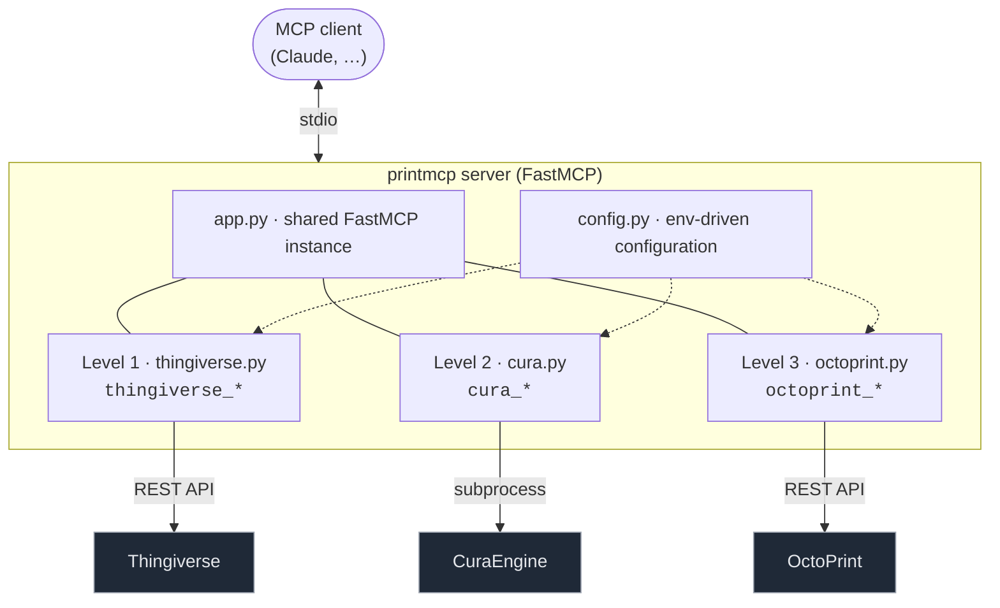

# 🏛️ Architecture

This page is for **contributors** and the curious — how PrintMCP is put together and why. If you
just want to use it, the [tutorials](README.md#-start-here) are the place to start.

---

## One server, three levels

PrintMCP is a **single MCP server** (`printmcp`) that exposes three groups of tools, one per
stage of the printing pipeline:



### Why one server instead of three?
A single server means one thing to install, configure, and register with a client — and it lets
an assistant carry context across the whole pipeline (the path it just downloaded flows straight
into slicing, then printing). Tool names are **source-prefixed** (`thingiverse_*`, `cura_*`,
`octoprint_*`) so groups never collide and new sources can be added cleanly.

### Why levels are independent
Each level reads its own configuration and fails gracefully on its own terms. With only a
Thingiverse token you get Level 1; Cura unlocks Level 2; OctoPrint unlocks Level 3. No level
imports another's runtime state.

---

## Module layout

| File | Responsibility |
|------|----------------|
| `src/printmcp/app.py` | Creates the shared `FastMCP` instance. Kept separate to avoid an import cycle. |
| `src/printmcp/server.py` | Entry point + CLI. Parses `--version`/`--help`/`--check`; with no args, imports the tool modules (registration is an import side effect) and runs `mcp.run()`. |
| `src/printmcp/config.py` | All environment-driven configuration: tokens, download dir, Cura discovery, OctoPrint URL/key. |
| `src/printmcp/thingiverse.py` | Level 1 tools — async `httpx` calls to the Thingiverse REST API. |
| `src/printmcp/cura.py` | Level 2 tool — invokes the CuraEngine subprocess off the event loop. |
| `src/printmcp/octoprint.py` | Level 3 tools — async `httpx` calls to the OctoPrint REST API, behind the confirm gate. |
| `src/printmcp/__main__.py` | Enables `python -m printmcp`. |
| `tests/` | Offline tests (input validation + mock-transport HTTP plumbing). |

### Tool registration
Tools register themselves via the `@mcp.tool(...)` decorator at import time. `server.py:main()`
imports `thingiverse`, `cura`, and `octoprint` for their side effects **before** calling
`mcp.run()`. `app.py` holds the `mcp` instance so tool modules can import it without depending on
`server.py` (which would be circular).

### CLI

`main()` also handles a few one-shot flags before ever starting the server: `--version`,
`--help`, and `--check` (a per-level configuration self-diagnostic). All CLI output is written to
**stderr**, because stdout is reserved for the MCP stdio protocol — printing to it in server mode
would corrupt the channel. `__version__` is derived from the installed package metadata
(`importlib.metadata`) so there's a single source of truth with `pyproject.toml`.

---

## Conventions shared by every tool

These patterns repeat across all three levels — match them when adding a tool:

1. **Pydantic v2 input model.** Each tool takes a single `params` model with
   `ConfigDict(str_strip_whitespace=True, validate_assignment=True, extra="forbid")`, typed
   `Field`s with ranges/constraints, and validators where needed. This gives clients a precise
   input schema and rejects bad input before any work happens.
2. **`response_format`.** Every tool returns either human `markdown` or machine `json`.
3. **Errors as strings.** Tools wrap their body in `try/except` and return `Error: <reason>`
   via a per-level `_handle_error(...)` that maps exceptions (HTTP status codes, timeouts,
   missing config) to concise, actionable messages — never a raw traceback, never a secret.
4. **Tool annotations.** `readOnlyHint`, `destructiveHint`, `idempotentHint`, `openWorldHint`
   describe each tool to the client so it can reason about safety.

---

## Level-specific notes

### Level 1 — Thingiverse (`thingiverse.py`)
- Async `httpx.AsyncClient`; the token rides in an `Authorization: Bearer` header.
- Downloads stream to disk in chunks. Filenames are sanitized (`_safe_filename`) and the
  destination is path-traversal-guarded.
- On the cross-host redirect to Thingiverse's CDN, httpx drops the `Authorization` header
  automatically, so the token isn't leaked to the file host.

### Level 2 — Cura (`cura.py`)
- Wraps the **headless CuraEngine** binary via `subprocess.run`, executed through
  `anyio.to_thread.run_sync` so the blocking call doesn't stall the event loop (this also avoids
  Windows asyncio-subprocess quirks).
- Several engine-correctness details are handled for the caller: pointing the extruder search
  path correctly, ordering global `-s` settings **before** the model (or they'd be treated as
  per-mesh), supplying CLI defaults Cura 5.11 omits, and parsing real print-time/filament stats
  from the engine's **log** (the standalone G-code header only has placeholders).
- The subprocess environment is scrubbed of API credentials it doesn't need.

### Level 3 — OctoPrint (`octoprint.py`)
- Async `httpx`; the API key rides **only** in the `X-Api-Key` header to the configured host,
  read once per request so URL and key can't desync.
- The **confirm gate** is the defining feature: every actuating tool checks `confirm` and
  returns a dry-run preview (via `_confirm_required`) before constructing any request. See
  [Safety Model](safety.md).
- Response parsing is defensive throughout (missing keys, non-dict shapes, `409` when the
  printer isn't operational) so an unusual printer state yields a friendly message, not a crash.

---

## Testing strategy

All tests are **offline** — no token, network, Cura, or printer required — so they run anywhere
in a couple of seconds:

- **Input validation & helpers** — registration, filename sanitization, slice-input ranges,
  duration/stats formatting, the Cura version-sort and subprocess-env scrubbing.
- **Safety gate** — every actuating tool, called with `confirm=false`, sends **zero** requests.
- **HTTP plumbing** — `httpx.MockTransport` intercepts requests so tests assert the exact
  method, path, JSON body, and `X-Api-Key` header of every OctoPrint call, that responses parse
  to the documented shape, and that error statuses map to friendly strings without leaking the
  key.

```bash
uv run pytest -q
```

---

## Extending PrintMCP

### Add a tool to an existing level
Define a Pydantic input model and an `@mcp.tool(...)`-decorated async function in the level's
module, following the conventions above. Add offline tests (mock transport for any HTTP).

### Add a new source (e.g. Printables)
Create `src/printmcp/printables.py` with `printables_*` tools, add config to `config.py`, and
import it in `server.py:main()`. The source-prefix convention keeps it conflict-free.

### Add a new print backend (e.g. Moonraker/Klipper)
Mirror `octoprint.py` as `moonraker.py` with `moonraker_*` tools and the **same confirm gate**.
The tool-name prefix is the seam — no shared abstraction is imposed, by design, to avoid
premature coupling between backends.

---

## Design principles, in short

- **Prefer official APIs over scraping.** Thingiverse and OctoPrint REST; CuraEngine's CLI.
- **Surface licenses.** So downloaded models aren't misused.
- **Fail readable, never leak.** Errors are actionable strings; secrets stay in headers.
- **No accidental motion.** Physical actions require explicit `confirm=true`.
- **Keep levels independent.** Each works on its own; the pipeline is the sum, not a dependency
  chain.
