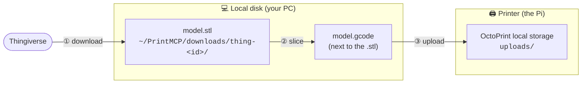

# ⚙️ Configuration

PrintMCP is configured entirely through **environment variables**. A `.env` file in the project
root is loaded automatically at startup (via `python-dotenv`), so the easiest setup is to copy
`.env.example` to `.env` and fill in values.

```bash
cp .env.example .env     # Windows: copy .env.example .env
```

---

## All variables

| Variable | Level | Required | Default | Purpose |
|----------|:-----:|:--------:|---------|---------|
| `THINGIVERSE_TOKEN` | 1 | Yes (for L1) | — | Thingiverse REST API App Token. |
| `PRINTMCP_DOWNLOAD_DIR` | 1 | No | `~/PrintMCP/downloads` | Where downloaded models are saved. |
| `PRINTMCP_CURA_DIR` | 2 | No | auto-detected | Ultimaker Cura install folder. |
| `PRINTMCP_CURAENGINE` | 2 | No | `<cura>/CuraEngine.exe` | Path to the CuraEngine executable, if outside the Cura folder. |
| `OCTOPRINT_URL` | 3 | Yes (for L3) | — | Base URL of your OctoPrint server. |
| `OCTOPRINT_API_KEY` | 3 | Yes (for L3) | — | OctoPrint API key (sent only in the `X-Api-Key` header). |

> [!NOTE]
> "Required" is per level. With just `THINGIVERSE_TOKEN` you can search and download. Slicing
> needs Cura present (usually auto-detected). Printing needs the two `OCTOPRINT_*` values.

---

## Thingiverse (Level 1)

### `THINGIVERSE_TOKEN`
1. Register an app at <https://www.thingiverse.com/apps/create>.
2. Copy its **App Token** (an OAuth access token also works).
3. Set `THINGIVERSE_TOKEN=...` in `.env`.

Without it, every Level 1 tool returns a clear `Error: THINGIVERSE_TOKEN is not set …`.

### `PRINTMCP_DOWNLOAD_DIR`
Where `thingiverse_download_model` saves files. Defaults to `~/PrintMCP/downloads`
(on Windows, `C:\Users\<you>\PrintMCP\downloads`). Set an absolute path to override:

```dotenv
PRINTMCP_DOWNLOAD_DIR=D:\3DPrints\models
```

---

## Cura (Level 2)

PrintMCP drives the **headless CuraEngine** bundled with Ultimaker Cura. On Windows it
auto-detects the newest `UltiMaker Cura X.Y.Z` under `C:\Program Files`. You only need these
if auto-detection fails or Cura lives somewhere unusual.

### `PRINTMCP_CURA_DIR`
The Cura install **folder**:

```dotenv
PRINTMCP_CURA_DIR=C:\Program Files\UltiMaker Cura 5.11.0
```

PrintMCP looks for the engine and the printer-definition resources beneath it.

### `PRINTMCP_CURAENGINE`
Full path to the **executable**, if it's not inside the Cura folder:

```dotenv
PRINTMCP_CURAENGINE=C:\tools\CuraEngine\CuraEngine.exe
```

> [!TIP]
> Confirm what PrintMCP resolved:
> ```bash
> uv run python -c "from printmcp.config import get_cura_paths; print(get_cura_paths())"
> ```

---

## OctoPrint (Level 3)

### `OCTOPRINT_URL`
The base URL of your printer's OctoPrint server — no trailing slash needed (it's trimmed):

```dotenv
OCTOPRINT_URL=http://octopi.local
# or
OCTOPRINT_URL=http://192.168.1.50:80
```

### `OCTOPRINT_API_KEY`
An OctoPrint API key. Two kinds work:
- **Global key:** OctoPrint → **Settings → API**.
- **Application key:** your user account → **Application Keys** (preferred; revocable per app).

```dotenv
OCTOPRINT_API_KEY=ABCDEF0123456789ABCDEF0123456789
```

> [!IMPORTANT]
> The key is transmitted **only** in the `X-Api-Key` header to `OCTOPRINT_URL`, and is never
> echoed into any tool output or error message (there's a test that enforces this). Keep `.env`
> out of git — it already is.

---

## 📁 Where print files are stored

Files live in **three** places as a job moves through the pipeline:



### ① Downloaded models — local
- **Location:** `PRINTMCP_DOWNLOAD_DIR` or `~/PrintMCP/downloads`.
- **Layout:** one subfolder per thing, named `thing-<id>` (override with the
  `dest_subdir` parameter of `thingiverse_download_model`).
- Example: `C:\Users\Sbuss\PrintMCP\downloads\thing-159884\Coffee_Cup.A.1.stl`.

### ② Sliced G-code — local
- **Default:** written **next to the source model** with a `.gcode` extension — slicing
  `…\cup.stl` yields `…\cup.gcode`.
- Override with the `output_path` parameter of `cura_slice_model`.

### ③ On the printer — remote
- `octoprint_upload_file` **POSTs** the file into OctoPrint's `local` storage (physically the
  Raspberry Pi's SD card, typically `~/.octoprint/uploads/`). Nothing is stored locally by this
  step.
- From then on you reference it by its **server-side path** (e.g. `cup.gcode`), which
  `octoprint_list_files` reads back and `octoprint_start_print` consumes. Use `dest_path` to
  upload into a server subfolder.

> [!NOTE]
> The Git repository never holds print files: downloads and G-code go to `~/PrintMCP` (outside
> the repo), and `.gitignore` blocks `downloads/` and `*.gcode` for good measure.

---

## Precedence & loading order

1. Real environment variables take precedence over `.env`.
2. `.env` is loaded from the current working directory (or a parent) at import time.
3. Cura discovery order: `PRINTMCP_CURA_DIR` → derived from `PRINTMCP_CURAENGINE` → auto-detect
   the newest install under `C:\Program Files`.

See [Troubleshooting](troubleshooting.md) if a value doesn't seem to take effect.
