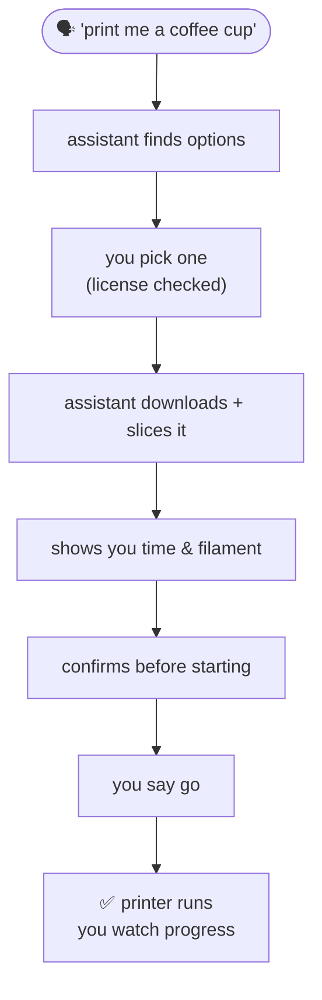

# Tutorial 4 · From Idea to Object, Start to Finish

> **Goal:** see how the whole thing comes together — going from *"I want to print X"* to a
> finished object in a single, natural conversation.
> **Time:** ~10 minutes of chatting · **You need:** everything set up
> ([Getting Started](../getting-started.md)). Do [Tutorials 1–3](01-find-and-download.md) first
> if you haven't.

The first three tutorials walked each stage separately. The real magic is that you don't have to
think in stages at all — you just describe what you want, and your assistant carries it from
search to finished print, checking with you at the moments that matter.

---

## The whole journey, in one conversation

Five behind-the-scenes stages — find, download, slice, upload, print — but to you it's just a
chat.

---

## What it actually sounds like

> 💬 **You:** "I want to print a coffee cup. Can you find one, get it ready for my Ender 3, and
> start printing it?"

> 🤖 **Assistant:** "On it. I found a few coffee cups on Thingiverse — here are the top three:
> 1. **Coffee Cup** by Barspin (simple, classic)
> 2. **Espresso Cup** by maker_jane (small, no handle)
> 3. **Travel Mug** by printsmith (tall, with lid)
>
> Which would you like? I'll check the license and get it ready."

> 💬 **You:** "The first one."

> 🤖 **Assistant:** "Good pick. The Coffee Cup is *Creative Commons – Attribution* (free to print
> and even sell with credit). I've downloaded it and sliced it for your Ender-3 Pro at standard
> quality — it'll take about **6½ hours** and use **~25 m** of filament.
>
> Before I start the physical printer: ready for me to begin? It'll heat the nozzle to ~200°C and
> start printing."

> 💬 **You:** "Yes, go for it."

> 🤖 **Assistant:** "Printing now! 🎉 I'll report progress whenever you check in."

> 💬 **You:** *(a couple hours later)* "How's it going?"

> 🤖 **Assistant:** "About **42%** done — roughly 3 hours 45 minutes left. Looking good."

One request, one finished cup. The assistant handled the busywork; you made the decisions that
mattered (which model, and the go-ahead to start).

---

## You're always in the driver's seat

Even in a single flowing request, you can steer at any point:

- 💬 *"Actually, find something simpler."*
- 💬 *"Slice it faster — it's just a test print."*
- 💬 *"Wait, how much filament will that use?"*
- 💬 *"Hold off on printing, I'll start it tonight."*

And anything that physically affects your printer — starting, heating, moving — always gets a
confirmation first. You can hand off as much or as little as you like.

---

## Handy things to ask for

Once you're comfortable, these all work as single requests:

| Goal | Just say… |
|------|-----------|
| Quick draft print | 💬 *"Find a phone stand and print it fast, quality doesn't matter."* |
| Careful, high-quality print | 💬 *"Print this as smoothly as possible, I don't mind if it's slow."* |
| Prep without committing | 💬 *"Download and slice a benchy, but don't print yet — just have it ready."* |
| Check feasibility first | 💬 *"Find a desk organizer that'll fit my 220mm bed and tell me the print time before starting."* |

---

## 🎉 You've completed the tutorials

You can now go from an idea to a finished 3D print just by talking to your assistant — and you
understand the safety check that protects your machine along the way.

### Where to go next

- **Stuck on something?** [Troubleshooting](../troubleshooting.md) covers the common hiccups.
- **Want to understand the safety check?** [Safety guide](../safety.md).
- **Curious how it all works under the hood?** [Architecture](../architecture.md), and the
  per-tool reference for [finding](../tools/thingiverse.md), [slicing](../tools/cura.md), and
  [printing](../tools/octoprint.md).

Happy printing! 🖨️
