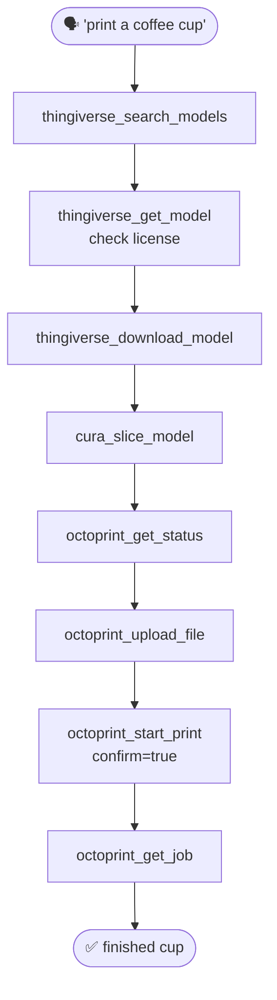

# Tutorial 4 · The Full Pipeline

> **Goal:** run the entire pipeline — **idea → model → slice → print** — as one continuous flow,
> the way an AI assistant drives PrintMCP in practice.
> **Time:** ~10 minutes of interaction · **You need:** all three levels configured (Thingiverse
> token, Cura, OctoPrint). Do [Tutorials 1–3](01-find-and-download.md) first if you haven't.

Tutorials 1–3 taught each level in isolation. This one shows the payoff: a single request like
*"print me a coffee cup"* flowing all the way to plastic on the bed.

---

## The whole pipeline, end to end



---

## The run, step by step

### 1. Find it

```text
thingiverse_search_models(query="coffee cup", limit=5)
→ pick id 159884
```

### 2. Vet it (license!)

```text
thingiverse_get_model(thing_id=159884)
→ License: Creative Commons - Attribution ✓   files listed
```

### 3. Download it

```text
thingiverse_download_model(thing_id=159884)
→ C:\Users\Sbuss\PrintMCP\downloads\thing-159884\Coffee_Cup.A.1.stl
```

### 4. Slice it

```text
cura_slice_model(model_path="…\\thing-159884\\Coffee_Cup.A.1.stl")
→ …\Coffee_Cup.A.1.gcode   (≈ 6h 31m, 25.5 m filament)
```

### 5. Confirm the printer's ready 👁️

```text
octoprint_get_status()
→ Connection: Operational · Ready to print: yes
```

### 6. Upload it 🔒¹

```text
octoprint_upload_file(gcode_path="…\\Coffee_Cup.A.1.gcode")
→ Server path: Coffee_Cup.A.1.gcode
```

### 7. Start it 🔒

```text
octoprint_start_print(path="Coffee_Cup.A.1.gcode", confirm=true)
→ Started printing 'Coffee_Cup.A.1.gcode'.
```

### 8. Watch it 👁️

```text
octoprint_get_job()
→ Printing · 42.5% · 3h 45m remaining
```

That's the entire pipeline — five tools across three levels, one cup. 🎉

---

## What this looks like in conversation

With PrintMCP registered in your assistant, you don't call tools by hand — you just talk:

> **You:** "Find me a coffee cup to print, slice it for my Ender 3, and start it on the printer."
>
> **Assistant:** *searches Thingiverse → shows you a few options with licenses → you pick one →
> downloads it → slices it (telling you it's ~6½ hours and 25 m of filament) → checks the
> printer is ready → uploads → **pauses to confirm** before starting a physical print → you say
> go → it starts and reports progress.*

The assistant orchestrates the tools; the **safety gate** ensures the one irreversible step —
starting the physical print — happens only with your explicit `confirm=true`.

---

## Handy end-to-end variations

**Draft-quality, faster print:**

```text
cura_slice_model(model_path="…\\Coffee_Cup.A.1.stl", layer_height=0.3, infill_density=10)
```

**Upload and start in a single step** (once you trust the setup):

```text
octoprint_upload_file(gcode_path="…\\Coffee_Cup.A.1.gcode", print_after_upload=true, confirm=true)
```

**Preheat while you decide** (start warming the bed/nozzle before committing to the print):

```text
octoprint_set_temperature(heater="bed", target=60, confirm=true)
octoprint_set_temperature(heater="tool", target=200, confirm=true)
```

---

## ✅ You've completed the tutorials

You can now drive the full 3D-printing pipeline through PrintMCP — from a vague idea to a
finished object — and you understand the safety model that protects your machine along the way.

### Where to go next

- **Reference:** the per-tool docs — [Thingiverse](../tools/thingiverse.md) ·
  [Cura](../tools/cura.md) · [OctoPrint](../tools/octoprint.md).
- **Deepen:** the [Safety Model](../safety.md) and [Architecture](../architecture.md).
- **Stuck?** [Troubleshooting](../troubleshooting.md).

Happy printing! 🖨️
